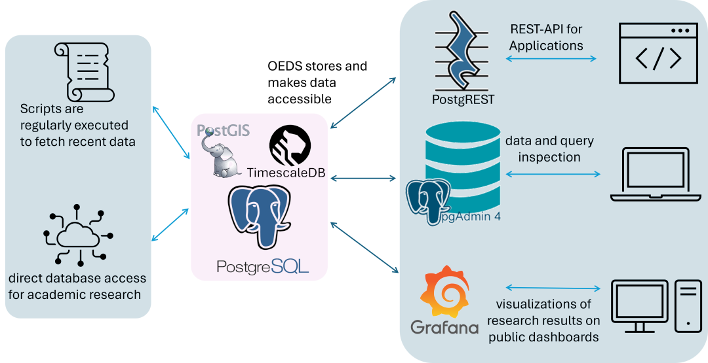
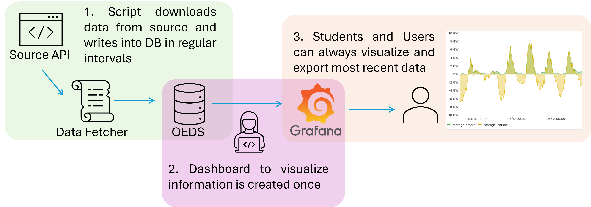

.. OEDS documentation master file, created by
   sphinx-quickstart on Thu Jul 26 2024.

Welcome to OEDS's Documentation!
=================================

Welcome to the official documentation for OEDS! This guide will help you get started, walk you through examples, and provide detailed instructions on backup, restore, and migration processes.

.. toctree::
   :maxdepth: 2
   :caption: Contents:

   getting_started
   README

OEDS Architecture
-----------------

OEDS Workflow
-------------

Mini Walkthrough
================

* `Minimal Example Walkthrough <minimal_walkthrough/minimal_example_walkthrough.md>`_ - Step-by-step walkthrough of a minimal example using Open Power System Data (OPSD) national energy generation dataset.
    * `opsd_national_generation_capacity_crawler.py <https://github.com/NOWUM/open-energy-data-server/blob/main/docs/source/minimal_walkthrough/opsd_national_generation_capacity_crawler.py>`_ - Python crawler for national generation capacity.
    * `postgrest_stored_procedure.sql <https://github.com/NOWUM/open-energy-data-server/blob/main/docs/source/minimal_walkthrough/postgrest_stored_procedure.sql>`_ - Stored procedure for PostgREST.
    * `python_postgrest_visualise.py <https://github.com/NOWUM/open-energy-data-server/blob/main/docs/source/minimal_walkthrough/python_postgrest_visualise.py>`_ - Python script for PostgREST visualization.
    * `walkthrough_util.py <https://github.com/NOWUM/open-energy-data-server/blob/main/docs/source/minimal_walkthrough/walkthrough_util.py>`_ - Utility functions for the walkthrough.

Usage Examples
==============

* `Application Examples <examples/application_examples.md>`_ - Application examples.
* `Client Export Examples <examples/client_export_examples.md>`_ - Export examples for SQL clients.
* `HTTP Export Examples <examples/http_export_examples.md>`_ - Examples for exporting via HTTP.
* `SQL Helpers <https://github.com/NOWUM/open-energy-data-server/blob/main/docs/source/examples/metadata_sql_helpers.sql>`_ - SQL helpers for metadata operations.

Backup and Migration
====================

* `Backup, Restore, and Migration <backup_restore_migration/backup_restore_migrate.md>`_ - Comprehensive guide for backup, restore, and migration.
    * `dummy_db.sh <https://github.com/NOWUM/open-energy-data-server/blob/main/docs/source/backup_restore_migration/dummy_db.sh>`_ - Script for dummy database setup.
    * `db_migrate.sh <https://github.com/NOWUM/open-energy-data-server/blob/main/docs/source/backup_restore_migration/db_migrate.sh>`_ - Script for whole database migration.
    * `schema_migrate.sh <https://github.com/NOWUM/open-energy-data-server/blob/main/docs/source/backup_restore_migration/schema_migrate.sh>`_ - Script for individual schema migration.
